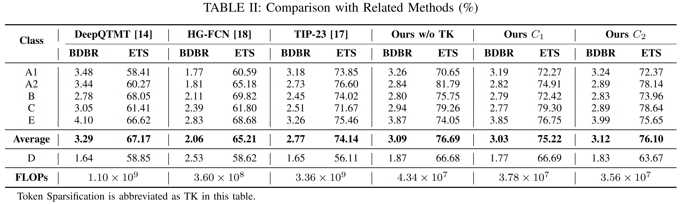

<div align="center">

<h1>Efficient Partition Map Prediction  via Token Sparsification for Fast VVC Intra Coding</h1>

<div>
    <a href='https://zhexinliang.github.io/' target='_blank'>Xinmin Feng</a>&emsp;
    <a href='https://faculty.ustc.edu.cn/lil1/en/index.htm' target='_blank'>Li Li</a>&emsp;
    <a href='https://faculty.ustc.edu.cn/dongeliu/en/index.htm' target='_blank'>Dong Liu</a>&emsp;
    <a href='https://scholar.google.com/citations?user=5bInRDEAAAAJ&hl=en&oi=ao' target='_blank'>Feng Wu</a>
</div>
<div>
    Intelligent Visual Lab, University of Science and Technology of China &emsp; 
</div>

<div>
   <strong>MMSP2024</strong>
</div>
<div>
    <h4 align="center">
    </h4>
</div>


</div>

As one of the key aspects of Versatile Video Coding (VVC), the quad-tree with a nested multi-type tree (QTMT) partition structure enhances the rate-distortion (RD) performance but at the cost of extensive computational encoding complexity. To reduce the complexity of QTMT partition in VVC intraframe coding, researchers proposed the partition map-based fast block partitioning algorithm, which achieves advanced encoding time savings and coding efficiency. However, it encounters high inference overhead due to the over-parameterized neural network. To efficiently deploy this algorithm, we first propose a lightweight neural network based on the hierarchical vision transformer that predicts the partition map effectively with restricted computational complexity, thereby reducing the inference complexity uniformly. 
Next, we introduce token sparsification to select the most informative tokens using a predefined pruning ratio, achieving content-adaptive computation reduction and parallel-friendly inference. Experimental results demonstrate that the proposed method reduces **98.94\%** FLOPs with a negligible BDBR increase compared to the original methods.

<div>
   <strong>Performance Evaluation</strong>
</div>




</div>

## :mega: Updates
- **2024.08.03**: Our paper is accepted by MMSP2024 as a regular paper.

## :desktop_computer: Requirements

- Pytorch >= 1.13.1
- CUDA >= 11.3
- Other required packages in `pip_opt.sh`

## :running_woman: Inference

### Prepare Testing Data:
You can put the testing images in the `input` folder. If you want to test the backlit images, you can download the BAID test dataset and the Backlit300 dataset from [[Google Drive](https://drive.google.com/drive/folders/1tnZdCxmWeOXMbzXKf-V4HYI4rBRl90Qk?usp=sharing) | [BaiduPan (key:1234)](https://pan.baidu.com/s/1bdGTpVeaHNLWN4uvYLRXXA)].

### Testing:

```
python test.py
```
The path of input images and output images and checkpoints can be changed. 

Example usage:
```
python test.py -i ./Backlit300 -o ./inference_results/Backlit300 -c ./pretrained_models/enhancement_model.pth
```

## :train: Training

### Prepare Training Data and the initial weights:
You should download the backlit and reference image dataset and put it under the repo. In our experiment, we randomly select 380 backlit images from BAID training dataset and 384 well-lit images from DIV2K dataset as the unpaired training data. We provide the training data we use at [[Google Drive](https://drive.google.com/drive/folders/1X1tawqmUsn69T24VmHSl_qmEFxGLzMf0?usp=sharing) | [BaiduPan (key:1234)](https://pan.baidu.com/s/1a0_mUpoFJszjH1eHfBbJPw)] for your reference.

You should also download the initial prompt pair checkpoint (`init_prompt_pair.pth`) from [[Release](https://github.com/ZhexinLiang/CLIP-LIT/releases/tag/v1.0.0) | [Google Drive](https://drive.google.com/drive/folders/1mImPIUaYbXfZ_CHPvdNK-xKrt94abQO5?usp=sharing) | [BaiduPan (key:1234)](https://pan.baidu.com/s/1H4lOrLaYlS0PYTF4pgfSDw)] and put it into `pretrained_models/init_pretrained_models` folder.

After the data and the initial model weights are prepared, you can use the command to change the training data path, fine-tune the prompt and train the model.

If you don't want to download the initial prompt pair, you can train without the initial checkpoints using the command below. But in this way, the number of the total iterations should be at least $50K$ based on our experiments.
 
### Commands
Example usage:
```
python train.py -b ./train_data/BAID_380/resize_input/ -r ./train_data/DIV2K_384/
```
There are other arguments you may want to change. You can change the hyperparameters using the cmd line.

For example, you can use the following command to **train from scratch**.
```
python train.py \
 -b ./train_data/BAID_380/resize_input/ \
 -r ./train_data/DIV2K_384/             \
 --train_lr 0.00002                     \
 --prompt_lr 0.000005                   \
 --eta_min 5e-6                         \
 --weight_decay 0.001                   \
 --num_epochs 3000                      \
 --num_reconstruction_iters 1000        \
 --num_clip_pretrained_iters 8000       \
 --train_batch_size 8                   \
 --prompt_batch_size 16                 \
 --display_iter 20                      \
 --snapshot_iter 20                     \
 --prompt_display_iter 20               \
 --prompt_snapshot_iter 100             \
 --load_pretrain False                  \
 --load_pretrain_prompt False
```
Here are the explanation for important arguments:
- `b`: path to the input images (backlit images).
- `r`: path to the reference images (well-lit images).
- `train_lr`: the learning rate for the enhancement model training.
- `prompt_lr`: the learning rate for the prompt pair learning.
- `num_epochs`: the number of total training epoches. For the default setting, 1 epoch = $\frac{number\ of\ training\ images}{batch\ size}$ = 46 iteartions. 
- `num_reconstruction_iters`: the number of iterations for the reconstruction stage of the enhancement network (i.e. the initial enhancement network training), included in the `num_epochs`.
- `num_clip_pretrained_iters`: the number of iterations for the prompt initialization, included in the `num_epochs`.
- `train_batch_size`: the batch size for the enhancement model training.
- `prompt_batch_size`: the batch size for the prompt pair training.
- `display_iter`: the frequency to display the training log during the enhancement model training.
- `snapshot_iter`: the frequency to save the checkpoint during the enhancement model training.
- `prompt_display_iter`: the frequency to display the training log during the prompt pair learning.
- `prompt_snapshot_iter`: the frequency to save the checkpoint during the prompt pair learning.
- `load_pretrain`: whether to load the pretrained enhancement model.
- `load_pretrain_prompt`: whether to load the pretrained prompt pair.

- 


## :love_you_gesture: Citation
If you find our work useful for your research, please consider citing the paper:
```
@inproceedings{liang2023iterative,
  title={Iterative prompt learning for unsupervised backlit image enhancement},
  author={Liang, Zhexin and Li, Chongyi and Zhou, Shangchen and Feng, Ruicheng and Loy, Chen Change},
  booktitle={Proceedings of the IEEE/CVF International Conference on Computer Vision},
  pages={8094--8103},
  year={2023}
}
```


### Contact
If you have any questions, please feel free to reach out at `xmfeng2000@mail.ustc.edu.cn`. 

## :mag: Previous Work


[Partition Map Prediction for Fast Block Partitioning in VVC Intra-frame Coding](https://github.com/AolinFeng/PMP-VVC-TIP2023)


